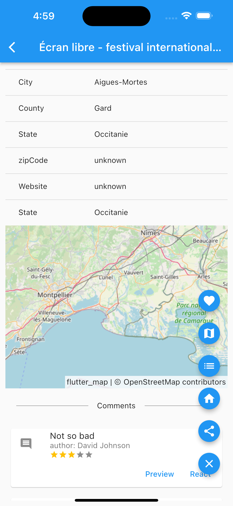
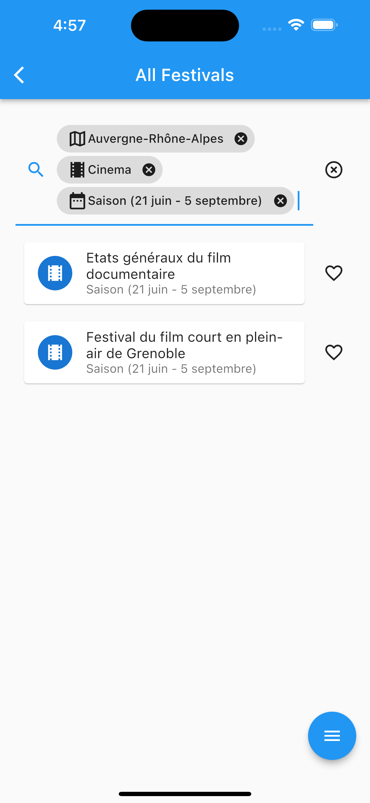
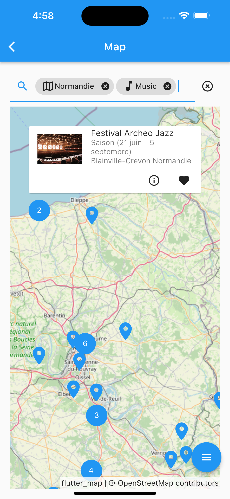

# culture_flutter_client

The Flutter clients for the Hackathon project of a certain computer master degree.

The period of hackathon was from 21 to 25 nov.

Future developments could be possible.

Flutter was chosen as we would like to develop cross platform applications mainly focused on mobile
devices.

Here are some screenshots as per the date of 25 nov:

  
   
  

## Highlights

- Loading of data from Firebase and use it as single source of truth
- Search box with tags
- Usage of map API
- Favorite item management
- Async calls and state management with MVVM using provider library
- Login, register and account settings
- A carousel view

## Could be improved

- "OR" tag in search box
- Comments (writing, reviewing and sync to DB)
- Better recommendation algorithm
- "Ticket management"
- Better loading effects
- Virtualization for lists in app
- Firebase notification and sync of source of data
- Light-weight backend for auth, DB cache and others
- OAuth, share to calendar, etc..

## Issues

- Lots of issues on macOS.

## Used 3rd part libs

- Firebase
- Provider (for implementation of MVVM pattern)
- Flutter expandable fab
- OSM Nominatim
- Flutter map
- Flutter map marker cluster
- LatLong 2
- Share plus
- Flutter launcher icons